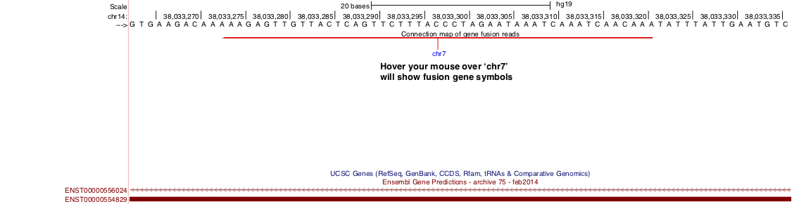

Output files
============
FusionVet generates 5 files

* prefix.fusion.sorted.bam
* prefix.fusion.sorted.bam.bai
* prefix.fusion.bed
* prefix.fusion.interact.bed
* prefix.fusion.summary.txt

prefix.fusion.sorted.bam
------------------------
BAM file containing the chimeric reads supporting gene fusions. Comparing to the 
orignal BAM file, two additional tags are added to each alignment record: FN (Fusion Name)
and SR (Supporting Read)

 * SR:i:1  :  Fusion was supported by split read
 * SR:i:2  :  Fusion was supported by paired reads
 * SR:I:3  :  Fusion was supported by both split read and paired reads.
 
::

 $ samtools view out.fusion.sorted.bam | head -10
 UNC13-SN749:172:D101FACXX:8:1104:12580:173001/1	99	chr21	39775575	66	48M	=	42879910	-3104288	CTTTCACCGCCCACTCCAGCCACTGCCGCACATGGTCTGTACTCCATA	CCCFFFFFHHHHHJJJJIIJJIJJJJIJIIJJJJJFHGJGFHIHIJJJ	RG:Z:120508_UNC13-SN749_0172_AD101FACXX_8_CGATGT	IH:i:1	HI:i:1	NM:i:0	SR:i:2	FN:Z:ERG--TMPRSS2
 UNC13-SN749:172:D101FACXX:8:1104:4678:34964/2	163	chr21	39817326	66	48M	=	42879890	-3062517	CCTTGAGCCATTCACCTGGCTAGGGTTACATTCCATTTTGATGGTGAC	CCCFFFDFHHHHBGHIJJJJJJIIJ?GIIGIJGGGIJJJJJJJJIFDG	RG:Z:120508_UNC13-SN749_0172_AD101FACXX_8_CGATGT	IH:i:1	HI:i:1	NM:i:0	SR:i:2	FN:Z:ERG--TMPRSS2
 UNC13-SN749:172:D101FACXX:8:1208:10044:4367/1	99	chr21	39817340	66	48M	=	42880015	-3062628	CCTGGCTAGGGTTACATTCCATTTTGATGGTGACCCTGGCTGGGGGTT	CCCFFFFFHHHFFIJJIJJJIIJJJJIIJJHJJJJIJJJIJJJJIJI>	RG:Z:120508_UNC13-SN749_0172_AD101FACXX_8_CGATGT	IH:i:1	HI:i:1	NM:i:0	SR:i:2	FN:Z:ERG--TMPRSS2
 UNC13-SN749:172:D101FACXX:8:1301:12176:174226/2	163	chr21	39817361	66	48M	=	42879922	-3062514	TTTTGATGGTGACCCTGGCTGGGGGTTGAGACAGCCAATCCTGCTGAG	BCCFFFFFHFHHHJJJJJJJJJJJJFHIIIJJIIJJJJJJJJIJIJJJ	RG:Z:120508_UNC13-SN749_0172_AD101FACXX_8_CGATGT	IH:i:1	HI:i:1	NM:i:0	SR:i:2	FN:Z:ERG--TMPRSS2
 UNC13-SN749:172:D101FACXX:8:2201:10011:20671/1	99	chr21	39817379	66	48M	=	42879951	-3062525	CTGGGGGTTGAGACAGCCAATCCTGCTGAGGGACGCGTGGGCTCATCT	CCCFFFFDHHHGHJJJJJJJJJJJIIJJJJJJIJIJGHHHFFFDEEEE	RG:Z:120508_UNC13-SN749_0172_AD101FACXX_8_CGATGT	IH:i:1	HI:i:1	NM:i:0	SR:i:2	FN:Z:ERG--TMPRSS2
 UNC13-SN749:172:D101FACXX:8:1108:17583:42031/2	163	chr21	39817384	65	48M	=	42880007	-3062576	GGTTGAGACAGCCAATCCTGCTGAGGGACGCGTGGGCTCATCTTGGAA	?@;BDFDABFFDHHAFHHGHIIIJGIIJGIAE?@6;FGH@DDCC@CA#	RG:Z:120508_UNC13-SN749_0172_AD101FACXX_8_CGATGT	IH:i:1	HI:i:1	NM:i:0	SR:i:2	FN:Z:ERG--TMPRSS2
 UNC13-SN749:172:D101FACXX:8:2302:8715:52295/1	99	chr21	39817385	66	48M	=	42879932	-3062500	GTTGAGACAGCCAATCCTGCTGAGGGACGCGTGGGCTCATCTTGGAAG	CCCFFFFFHHHHHJJJJJHJJJJJJJJJJJJFHIJIIJGIJIJIIJIJ	RG:Z:120508_UNC13-SN749_0172_AD101FACXX_8_CGATGT	IH:i:1	HI:i:1	NM:i:0	SR:i:2	FN:Z:ERG--TMPRSS2
 UNC13-SN749:172:D101FACXX:8:2305:11177:45091/1	99	chr21	39817385	66	48M	=	42880014	-3062582	GTTGAGACAGCCAATCCTGCTGAGGGACGCGTGGGCTCATCTTGGAAG	B@CFFFFFHHHHHJJJJJJJJJJJJJIJJJJHJJJJJJJJJJJJIJJG	RG:Z:120508_UNC13-SN749_0172_AD101FACXX_8_CGATGT	IH:i:1	HI:i:1	NM:i:0	SR:i:2	FN:Z:ERG--TMPRSS2
 UNC13-SN749:172:D101FACXX:8:2306:12796:14838/2	163	chr21	39817391	53	48M	=	42879889	-3062451	ACAGCCAATCCTGCTGAGGGACGCGTGGGCTCATCTTGGAAGTCTGTA	@CCFFFFFHHHGHJJJJJJJJJJJJHGIJIJJJJJJJJIIIJHHJ###	RG:Z:120508_UNC13-SN749_0172_AD101FACXX_8_CGATGT	IH:i:1	HI:i:1	NM:i:1	SR:i:2	FN:Z:ERG--TMPRSS2
 UNC13-SN749:172:D101FACXX:8:1308:12672:71749/1	99	chr21	39817394	66	48M	=	42880007	-3062566	GCCAATCCTGCTGAGGGACGCGTGGGCTCATCTTGGAAGTCTGTCCAT	?@@FDDDFADF?D@AAB?ACGAHHEHG@BFHIGHBB=8=88@C=@@CE	RG:Z:120508_UNC13-SN749_0172_AD101FACXX_8_CGATGT	IH:i:1	HI:i:1	NM:i:0	SR:i:2	FN:Z:ERG--TMPRSS2
 

prefix.fusion.sorted.bam.bai
----------------------------
The index file of prefix.fusion.sorted.bam

prefix.fusion.bed
-----------------
This is standard `BED12 <https://genome.ucsc.edu/FAQ/FAQformat.html#format1>`_ format file.
Paired reads are merged into a single BED entry. This file can be uploaded to `UCSC 
genome browser <https://genome.ucsc.edu>`_ to visualize intra-chromosomal fusions. This is
useful to identify the **fusion point**. If this file is too big to upload to UCSC genome
browser directly, you could try to convert this BED file into bigBed file (the program `bedToBigBed <http://hgdownload.soe.ucsc.edu/admin/exe/>`_)
following this `instruction <https://genome.ucsc.edu/goldenPath/help/bigBed.html>`_. 

prefix.fusion.interact.bed
--------------------------
This is `Interact <https://genome.ucsc.edu/goldenPath/help/interact.html>`_ format file. This
file can be uploaded to  `UCSC genome browser <https://genome.ucsc.edu>`_ to visualize both
intra-chromosomal and inter-chromosomal fusions. If this file is too big to upload to UCSC genome
browser directly, you could try to convert this Interact file into bigInteract file (the program `bedToBigBed <http://hgdownload.soe.ucsc.edu/admin/exe/>`_)
following this `instruction <https://genome.ucsc.edu/goldenPath/help/interact.html>`_. 

**Intra-chromosomal** fusions will be visualized as below (Note the two breaking points on ERG gene).
Toggle between **full** display mode and **pack**/**squish** display mode help identify the exact breaking point(s).

.. image:: ./_static/ERG_TMPRSS2.png
   :height: 200 px
   :width: 1000 px
   :scale: 60 %

**Inter-chromosomal** fusions will be visualized as below. 
Toggle between **full** display mode and **pack**/**squish** display mode help identify the exact breaking point(s).

prefix.fusion.summary.txt
--------------------------
Report the total number of supporting RNA fragments (split reads + read pairs) for each fusion.

::

 Sample_ID       ERG--TMPRSS2
 Tumor_RNA_TCGA-HC-7819-01A-11R-2118-07.bam      48