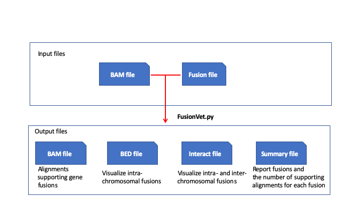

Overview
=========
Gene fusion is one of the most common somatic alterations that plays an important role in
tumorgenesis. Well-known examples include the intra-chromosomal TMPRSS2-ERG fusions
in prostate cancer, and the inter-chromosomal BCR-ABL fusions in chronic myelogenous
leukemia (CML). With the advent of next generation sequencing technologies especially RNA-seq
and the development of dozens of fusion detection tools, most recurrent
gene fusions in common cancers have been identified. These fusion are cataloged in databases 
such as `COSMIC <https://cancer.sanger.ac.uk/cosmic/fusion>`_ , 
`FusionGDB <https://ccsm.uth.edu/FusionGDB>`_
, `FusionHub <https://fusionhub.persistent.co.in>`_, 
`ChimerDB <http://203.255.191.229:8080/chimerdbv31/mhelp.cdb>`_ 
and `TumorFusions <https://tumorfusions.org>`_ ).

To facilitate molecular testing, we developed FusionVet (Fusion Visualization and
Evaluation Tool) to quickly (and accurately) examine if a gene fusion with clinical
significance exists in a particular sample or not.

